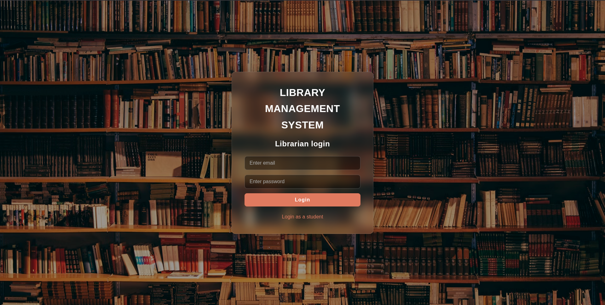
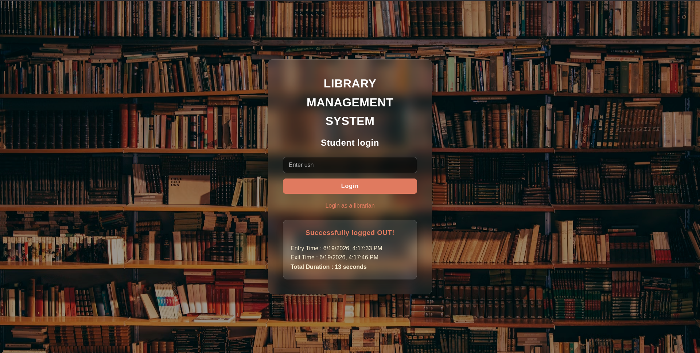
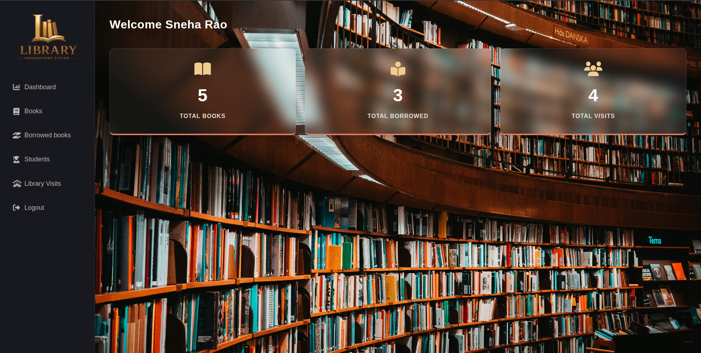
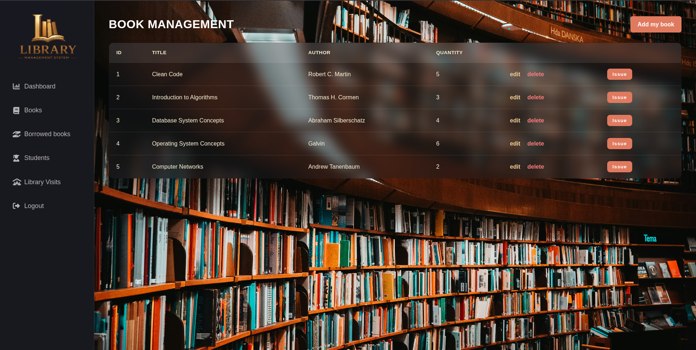
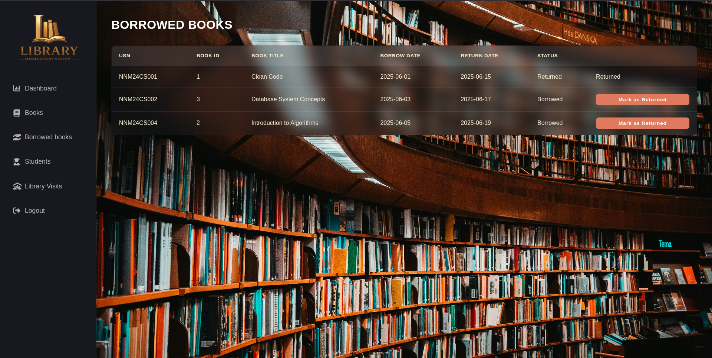
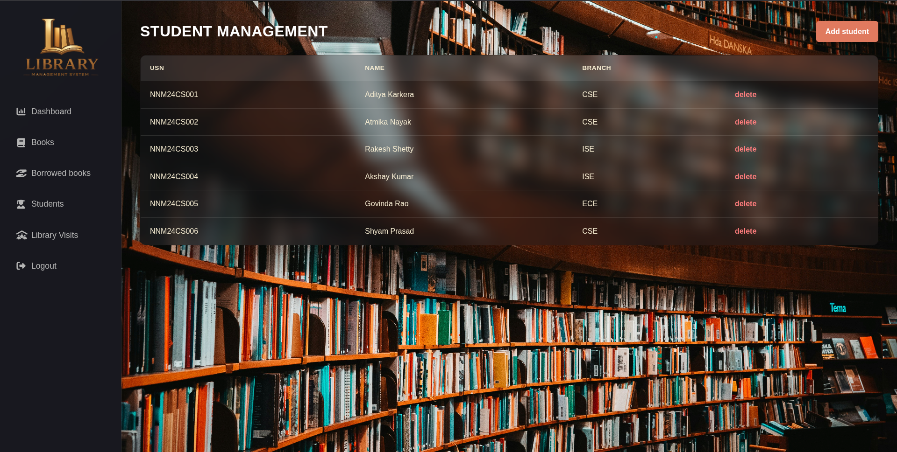
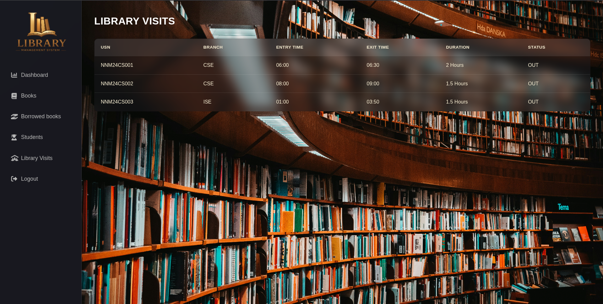

# Library Management System

A web-based Library Management System developed to simplify book circulation, student records, and library visit tracking. The system provides separate workflows for librarians and students, enabling efficient management of books, borrowing transactions, and library attendance.

## Live Demo

**Application:** https://library-management-system-c7cn.onrender.com

## Features

### Librarian Portal
- Secure librarian authentication using sessions
- Dashboard with library statistics
- Add, edit, and delete books
- Add and manage student records
- Issue books to students
- Mark borrowed books as returned
- Track all borrowing transactions
- View library visit history

### Student Portal
- Self-service library entry and exit logging
- Automatic visit duration calculation
- Instant attendance status updates

### Inventory Management
- Real-time book quantity tracking
- Automatic stock reduction during issue
- Automatic stock restoration on return
- Prevention of duplicate active borrow records

### Validation Rules
- Students must exist before a book can be issued
- Books cannot be issued when stock is unavailable
- Students cannot borrow the same book twice without returning it
- Books with active borrow records cannot be deleted
- Students with active borrowed books cannot be removed

---

## Tech Stack

### Frontend

<p>
  
  
  
</p>

### Backend

<p>
  
  
  
</p>

### Database

<p>
  
</p>

### Deployment

<p>
  
</p>

---

## Screenshots

### Librarian Login



### Student Login



### Dashboard



### Books Management



### Borrowed Books



### Students Management



### Library Visits



---

## Database Schema

### LIBRARIANS

| Column | Type |
|----------|----------|
| id | INTEGER (PK) |
| name | TEXT |
| email | TEXT |
| password | TEXT |

### STUDENTS

| Column | Type |
|----------|----------|
| usn | TEXT (PK) |
| name | TEXT |
| branch | TEXT |

### BOOKS

| Column | Type |
|----------|----------|
| id | INTEGER (PK) |
| title | TEXT |
| author | TEXT |
| quantity | INTEGER |

### BORROWEDBOOKS

| Column | Type |
|----------|----------|
| id | INTEGER (PK) |
| usn | TEXT |
| bookid | INTEGER |
| borrow_date | DATE |
| return_date | DATE |
| status | TEXT |

### LIBRARYVISITS

| Column | Type |
|----------|----------|
| id | INTEGER (PK) |
| usn | TEXT |
| entry_time | TEXT |
| exit_time | TEXT |
| duration | TEXT |
| status | TEXT |

---

## Application Workflow

### Book Issue Workflow

1. Librarian selects a book.
2. Student USN is validated.
3. Available quantity is checked.
4. Borrow transaction is created.
5. Return date is automatically set to 15 days later.
6. Book quantity is reduced by one.

### Book Return Workflow

1. Librarian marks a transaction as returned.
2. Borrow status is updated.
3. Book quantity is automatically increased.

### Library Visit Workflow

1. Student enters USN.
2. First scan creates an **IN** record.
3. Second scan creates an **OUT** record.
4. Duration is calculated automatically.
5. Visit history is stored for reporting.

---

## Routes

### Authentication

| Method | Route | Description |
|----------|----------|----------|
| GET | / | Login page |
| POST | /login | Librarian login |
| GET | /logout | Logout |

### Books

| Method | Route |
|----------|----------|
| GET | /books |
| GET | /books/add |
| POST | /books/add |
| GET | /books/editbook/:id |
| POST | /books/editbook/:id |
| GET | /books/delete/:id |
| GET | /books/issue/:id |
| POST | /books/issue |

### Students

| Method | Route |
|----------|----------|
| GET | /students |
| GET | /students/add |
| POST | /students/add |
| GET | /students/delete/:usn |

### Borrowed Books

| Method | Route |
|----------|----------|
| GET | /borrowedbooks |
| POST | /borrowedbooks/returned/:id |

### Library Visits

| Method | Route |
|----------|----------|
| GET | /libraryvisits |
| POST | /libraryvisits |
| GET | /visits |

---

## Installation

```bash
git clone <repository-url>

cd library-management-system

npm install

npm start
```

Open:

```text
http://localhost:5000
```

---

## Author

### Atmika Nayak

GitHub: https://github.com/AtmikaNayak
